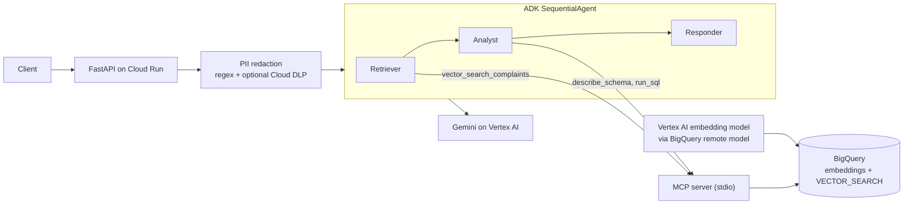

# Vertex Agent Platform: Multi-Agent Analytics

A support analytics assistant built on Vertex AI and BigQuery. A user asks a question about consumer complaints; three agents retrieve similar complaints with vector search, run SQL for the numbers, and write a grounded answer. PII is masked before anything reaches a model.

Data: public CFPB consumer complaints (`bigquery-public-data.cfpb_complaints.complaint_database`), subset with narratives copied into your own dataset.

## Architecture



| Piece | What it does |
|---|---|
| `data/` | SQL and a setup script: subset table, remote embedding model, embeddings table, vector index |
| `mcp_server/` | MCP server exposing `vector_search_complaints`, `run_sql` (read-only, capped) and `describe_schema` |
| `agents/` | Retriever, analyst and responder in an ADK `SequentialAgent`; each agent only gets the tools it needs |
| `pii/` | Redactor for emails, phones, SSNs, cards and names, applied to the question before the model call |
| `api/` | FastAPI `/ask` and `/health` |
| `eval/` | Retrieval hit@k and MRR, end to end latency, LLM-as-a-Judge via Vertex AI evaluation, PII leak check |
| `pipeline/` | Stretch: Vertex AI Pipeline that embeds only new complaints |

## Setup

Prerequisites: a GCP project with billing, `gcloud` and `bq` installed and logged in, Python 3.11.

```bash
# 0. Budget alert FIRST (replace the billing account id)
gcloud billing budgets create --billing-account=XXXXXX-XXXXXX-XXXXXX \
  --display-name="vertex-agent-platform" --budget-amount=20USD \
  --threshold-rule=percent=0.5 --threshold-rule=percent=0.9

# 1. Environment
python -m venv .venv && source .venv/bin/activate
pip install -r requirements.txt -r requirements-extra.txt
cp .env.example .env            # then set GOOGLE_CLOUD_PROJECT
gcloud auth application-default login

# 2. Data layer. Start small to smoke test, then rerun with the default 50000.
ROWS=5000 GOOGLE_CLOUD_PROJECT=your-project ./data/setup_bigquery.sh

# 3. Unit tests (no GCP needed)
pytest -q

# 4. Run the API locally and ask something
uvicorn api.main:app --port 8080
curl -s localhost:8080/ask -H 'Content-Type: application/json' \
  -d '{"question":"Which companies get the most debt collection complaints, and what are people upset about?"}'
```

## Evaluate (these produce the numbers for the table below)

```bash
python -m eval.retrieval_eval                       # hit@1, hit@5, MRR on 30 labeled queries
python -m eval.judge_eval --n 15                    # groundedness, answer quality, fluency, PII leak rate
python -m eval.latency_bench --url <service url> --n 20 --token "$(gcloud auth print-identity-token)"
```

Raw output is written to `eval/results/`. Commit it.

## Deploy

```bash
GOOGLE_CLOUD_PROJECT=your-project ./deploy.sh
```

Cloud Run runs the API with a dedicated service account that can run queries, read only the complaints dataset, call Vertex AI and use the embedding connection. Gemini is a managed Vertex AI model, so there is no custom model endpoint to host.

## Results

Measured on 50,000 CFPB complaints with narratives, using the scripts in `eval/`. Raw output is in `eval/results/`.

| Metric | Value | Notes |
|---|---|---|
| Rows embedded | 50,000 | text-embedding-005 through a BigQuery remote model |
| Retrieval hit@1 | 0.867 | 30 labeled queries, product-level match |
| Retrieval hit@5 | 0.967 | 29 of 30 queries |
| MRR | 0.917 | |
| Retrieval latency p50 / p95 | 5.1 s / 8.8 s | brute force search (the vector index showed 0% coverage during the run) |
| Judge groundedness | 0.73 | Vertex AI evaluation service, 15 questions, one run |
| Judge answer quality | 3.67 / 5 | same run |
| Judge fluency | 5.0 / 5 | same run |
| PII leak rate in answers | 0 of 15 | redactor run over every answer |
| End to end latency p50 / p95 | 15.1 s / 24.7 s | deployed Cloud Run service, 20 sequential requests, 0 failures; measured inside the service (excludes network); p95 is the slowest of 20 |
## Design notes and limits

- **Read-only SQL is layered.** The server rejects anything but a single SELECT or WITH, caps rows, and caps bytes billed per query. The real boundary is IAM: the service account only has dataset read access.
- **Retrieval quality is measured at product level** because the labeled set maps a query to a product category, not to a specific complaint. It tells you whether search lands in the right area, not whether it finds the single best complaint.
- **The vector index is approximate.** Until it finishes building, queries use brute force. State which one produced your numbers.
- **PII:** CFPB narratives are already masked at the source. The redactor protects against what users type. Regex names are intentionally narrow; turn on `USE_DLP=true` for broader detection.
- **In memory sessions.** Each request uses a fresh ADK session, so there is no conversation memory between calls.
- **Counts reflect the subset.** SQL answers count complaints in the 50,000 row sample, not all of CFPB.
- **Known retrieval miss.** One query (student loan forbearance leading to delinquency) did not return the expected product in the top 5. Its wording overlaps with credit reporting complaints.
- **Known groundedness gaps.** The judge flagged 4 of 15 answers for inferences beyond the retrieved evidence. Two runs gave 0.87 and 0.73, so treat groundedness as approximate at n = 15.
## Troubleshooting

- Column not found in step 1: check the public schema with `bq show --schema --format=prettyjson bigquery-public-data:cfpb_complaints.complaint_database` and adjust `data/01_create_subset.sql`.
- Embedding errors in step 3 usually mean IAM has not propagated to the connection service account yet. Wait a minute and rerun.
- ADK import errors in `agents/agents.py`: ADK renames things between releases. Check the current docs for `McpToolset` and `StdioConnectionParams`.
- `eval/judge_eval.py` import errors: check the current Vertex AI "Gen AI evaluation service" docs for `EvalTask` and metric names.
